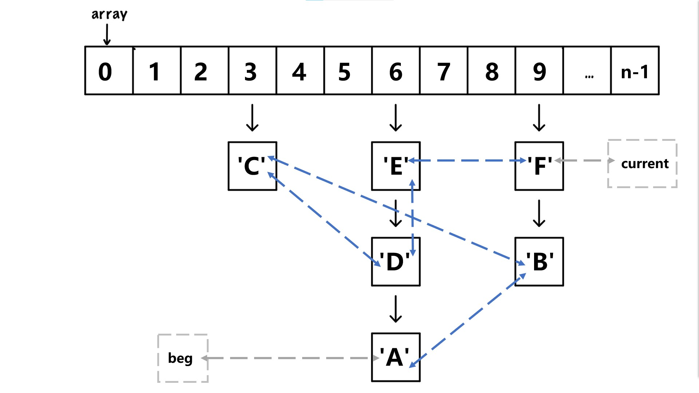

# 3. Linked Hash Map

**时间限制：3s，空间限制：256MB**

## 题目描述

在本题中，你需要实现一个``LinkedHashMap``，下面是对于这个结构的具体说明：

下图是对于这个结构的简要说明图，数组array的每个元素对应一个单链表。我们将``array[i]``指向的的节点称为链表的头节点，单链表最后一个结点称为尾节点。如在6下方对应的链表中`'E'`为头节点，`'A'`为尾节点。

除此以外，我们还需要实现一个双向链表（如图中蓝色虚线箭头所示）来维护元素的插入的先后顺序，例如上图的插入顺序是依照字符串的字典序``A,B,C,...``。在给定的代码框架中，我们给出beg指向双向链表的头结点，current指向双向链表的尾节点；但你也可以根据自己写双向链表的习惯修改或删除这两个节点。

遍历``LinkedHashMap``中的所有元素可以在以下两种方法中选择一种（在定义对象时指定）。分别为按照插入的时间从早到晚输出、按照`key`的从小至大输出。按照`key`的从小至大输出时，在每个`key`对应的链表输出时，将链表元素从头向尾输出。每个方法由一个全局函数实现。你需要在下方的两个全局函数中填入两种遍历的实现。

``LinkedHashMap``必须实现下列功能：

- 构造函数：参数为数组长度和本对象采用的遍历函数。根据传入的长度参数来构建一个长度恰为传入的长度参数的数组，数组的元素为给出的`node`类的指针。并将双链表设置为空表。保存遍历函数。
- 析构函数：释放空间。
- 插入指令`void insert(int key,string value)`：将新的节点插入在上图中`array[key]`对应的单链表的**头部**以及双链表的**尾部**。 
- 删除操作`void remove(int key,string value)`：删除指定`key`的单链表中值为`value`的结点。若不存在相应的`(key,value)`对，你不应当做任何事情。注意还需要在双链表中做删除操作。
- 查找操作`vector<string> ask(int key)const`：在要返回的`vector`中插入指定的`key`对应的链表中的所有`value`值，顺序为从链表的头向链表的尾。
- 输出链表的全部内容`vector<data> forEach()const`：根据所选的遍历函数遍历所有节点。
**tips：如果你没能够完成这个小问，你可以使用``LinkedHashMap_simple.hpp``来通过编译。**
* **注意：你不能使用``auto``关键字**
* **注意：除了修改构造函数中链表头指针的设计外，你仅能在//todo标识的地方写代码。**

## 输入格式

你不需要处理输入，可以参考下发的`main`函数。

## 输出格式

你不需要处理输出，可以参考下发的`main`函数。

## 样例输入

你不需要处理输入，可以参考下发的`main`函数。

## 样例输出

你不需要处理输出，可以参考下发的`main`函数。

## 数据范围

仅有一个复杂度的要求，删除双向链表中的元素复杂度为`O(1)`。

| check point | 考察的内容                                     | 分数       |
| ----------- | ---------------------------------------------- | ---------- |
| 1，2        | 考察插入和查找                                 | 2 x 5 = 10 |
| 3，4        | 考察插入，删除和查找                           | 2 x 5 = 10 |
| 5，6        | 考察插入，查找，按照key字典顺序输出            | 2 x 6 = 12 |
| 7，8        | 考察插入，查找，按照时间顺序输出               | 2 x 6 = 12 |
| 9，10，11   | 考察插入，删除，查找，按照key字典顺序输出      | 3 x 6 = 18 |
| 12，13，14  | 考察插入，删除，查找，按照时间顺序输出         | 3 x 6 = 18 |
| 15 ~ 22     | 数据内容同1 ~ 8，使用valgrind进行内存泄漏检查  | 8 x 1 = 8  |
| 23 ~ 28     | 数据内容同9 ~ 14，使用valgrind进行内存泄漏检查 | 6 x 2 = 12 |
